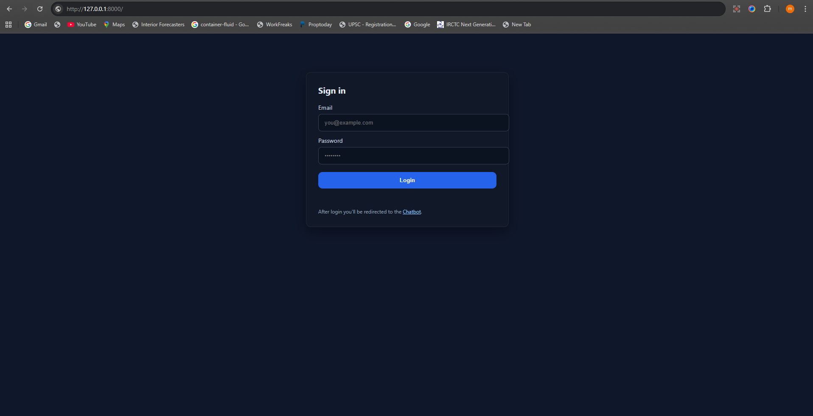
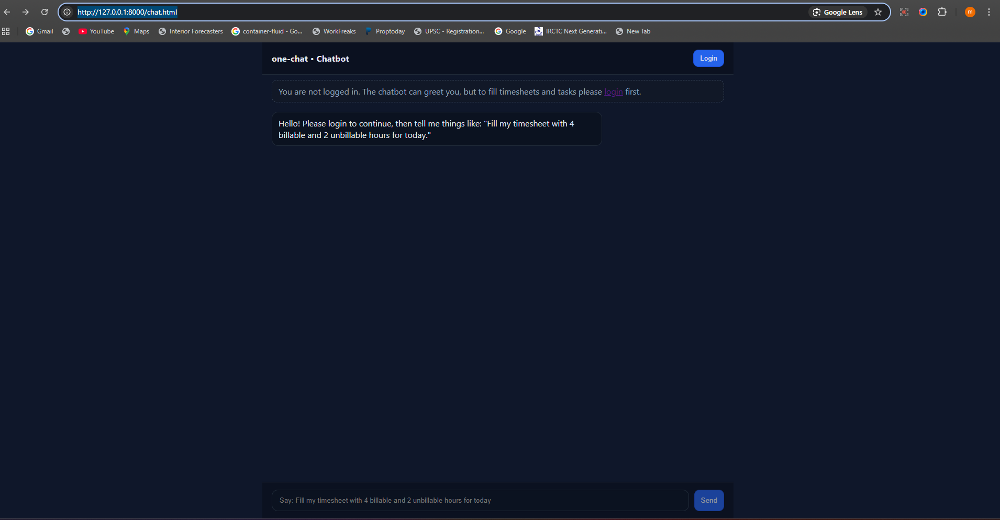

<p align="center"><a href="https://laravel.com" target="_blank"></a></p>

<p align="center">
<a href="https://github.com/laravel/framework/actions"></a>
<a href="https://packagist.org/packages/laravel/framework"></a>
<a href="https://packagist.org/packages/laravel/framework"></a>
<a href="https://packagist.org/packages/laravel/framework"></a>
</p>

## About Laravel

Laravel is a web application framework with expressive, elegant syntax. We believe development must be an enjoyable and creative experience to be truly fulfilling. Laravel takes the pain out of development by easing common tasks used in many web projects, such as:

- [Simple, fast routing engine](https://laravel.com/docs/routing).
- [Powerful dependency injection container](https://laravel.com/docs/container).
- Multiple back-ends for [session](https://laravel.com/docs/session) and [cache](https://laravel.com/docs/cache) storage.
- Expressive, intuitive [database ORM](https://laravel.com/docs/eloquent).
- Database agnostic [schema migrations](https://laravel.com/docs/migrations).
- [Robust background job processing](https://laravel.com/docs/queues).
- [Real-time event broadcasting](https://laravel.com/docs/broadcasting).

Laravel is accessible, powerful, and provides tools required for large, robust applications.

## Learning Laravel

Laravel has the most extensive and thorough [documentation](https://laravel.com/docs) and video tutorial library of all modern web application frameworks, making it a breeze to get started with the framework.

You may also try the [Laravel Bootcamp](https://bootcamp.laravel.com), where you will be guided through building a modern Laravel application from scratch.

If you don't feel like reading, [Laracasts](https://laracasts.com) can help. Laracasts contains thousands of video tutorials on a range of topics including Laravel, modern PHP, unit testing, and JavaScript. Boost your skills by digging into our comprehensive video library.

## Laravel Sponsors

We would like to extend our thanks to the following sponsors for funding Laravel development. If you are interested in becoming a sponsor, please visit the [Laravel Partners program](https://partners.laravel.com).

### Premium Partners

- **[Vehikl](https://vehikl.com/)**
- **[Tighten Co.](https://tighten.co)**
- **[WebReinvent](https://webreinvent.com/)**
- **[Kirschbaum Development Group](https://kirschbaumdevelopment.com)**
- **[64 Robots](https://64robots.com)**
- **[Curotec](https://www.curotec.com/services/technologies/laravel/)**
- **[Cyber-Duck](https://cyber-duck.co.uk)**
- **[DevSquad](https://devsquad.com/hire-laravel-developers)**
- **[Jump24](https://jump24.co.uk)**
- **[Redberry](https://redberry.international/laravel/)**
- **[Active Logic](https://activelogic.com)**
- **[byte5](https://byte5.de)**
- **[OP.GG](https://op.gg)**

## Contributing

Thank you for considering contributing to the Laravel framework! The contribution guide can be found in the [Laravel documentation](https://laravel.com/docs/contributions).

## Code of Conduct

In order to ensure that the Laravel community is welcoming to all, please review and abide by the [Code of Conduct](https://laravel.com/docs/contributions#code-of-conduct).

## Security Vulnerabilities

If you discover a security vulnerability within Laravel, please send an e-mail to Taylor Otwell via [taylor@laravel.com](mailto:taylor@laravel.com). All security vulnerabilities will be promptly addressed.

## License

The Laravel framework is open-sourced software licensed under the [MIT license](https://opensource.org/licenses/MIT).

---

# one-chat-api (Laravel 11)

This project is a Laravel 11 API backend configured for:

- Authentication against a separate user database using Laravel Sanctum personal access tokens.
- Project details served from a dedicated projects database.
- Daily timesheet CRUD against a dedicated timesheet database.

Key files added/updated:

- `bootstrap/app.php` – API routes enabled at `routes/api.php` and global `CorsMiddleware` registered.
- `routes/api.php` – Auth, Project, and Timesheet endpoints.
- `app/Http/Middleware/CorsMiddleware.php` – Simple configurable CORS.
- `app/Http/Controllers/AuthController.php` – Login (via external user DB), logout, and me endpoints.
- `app/Http/Controllers/ProjectController.php` – Project list and detail.
- `app/Http/Controllers/TimesheetController.php` – Timesheet list/create/update/delete.
- `config/database.php` – Three extra DB connections: `userdb`, `projectsdb`, `timesheetdb`.
- `.env.example` – Environment keys for the three DBs, table, and column names.

## Quick start

1) Install dependencies

```bash
composer install
```

2) Copy environment file and set values

```bash
copy .env.example .env
php artisan key:generate
```

Edit `.env` to point to your MySQL instances. Out of the box the default app connection is `sqlite` (database file at `database/database.sqlite`). If you prefer MySQL for app internals, uncomment the `DB_*` variables.

3) Database migrations (for app internals & Sanctum tokens)

The personal access tokens table is created on the default connection. If you keep `sqlite`, you can run:

```bash
php artisan migrate
```

If you switch the default to MySQL, ensure the database exists and credentials are correct before running migrate.

## API Endpoints

- `POST /api/auth/login` – Body: `{ email, password }` → `{ token, user }`
- `POST /api/auth/logout` – Header: `Authorization: Bearer <token>`
- `GET /api/auth/me` – Header: `Authorization: Bearer <token>`
- `GET /api/projects` – Header: `Authorization: Bearer <token>`
- `GET /api/projects/{id}` – Header: `Authorization: Bearer <token>`

### Timesheets

- `GET /api/timesheets`
  - Query: `date` (YYYY-MM-DD), `employee_id`, `project_id` (all optional)
  - Returns list (max 100)

- `POST /api/timesheets`
  - Body:
    - `date` (required, YYYY-MM-DD)
    - `employee_id` (required)
    - `project_id` (optional)
    - `billable_hours` (required, 0–9)
    - `unbillable_hours` (optional, >= 0)
    - `comment` (optional)
  - Rules:
    - Exactly one timesheet per `(date, employee_id)` (unique)
    - Creates with `Status = open` by default
  - Errors:
    - 422 `{ "message": "timesheet already filled for YYYY-MM-DD" }`

- `PATCH /api/timesheets/{id}`
  - Body (partial allowed):
    - `billable_hours` (0–9)
    - `unbillable_hours` (>= 0)
    - `comment`
    - `status` (`open` | `closed`)
    - `date`, `employee_id`, `project_id` (optional)
  - Rules:
    - Editing `billable_hours` is blocked when `Status = closed`
  - Errors:
    - 422 `{ "message": "timesheet closed for YYYY-MM-DD" }`

- `DELETE /api/timesheets/{id}`

Note: There is an end-of-day scheduler that automatically closes all open timesheets for the current day at `23:59` server time.

### Tasks

- `GET /api/tasks`
  - Query: `employee_id`, `project_id`, `time_sheet_id` (optional)

- `POST /api/tasks`
  - Body:
    - `employee_id` (required)
    - `project_id` (required)
    - `date` (required when `time_sheet_id` not provided)
    - `time_sheet_id` (optional)
    - `task_name` (required)
    - `task_description` (optional)
    - `task_mode` (optional; one of: `billable`, `unbillable`)
    - For billable tasks: `billable_hours` (required, 0–9)
    - For unbillable tasks: `unbillable_hours` (required, >= 0)
  - Billable rules:
    - Requires a timesheet for `(date, employee_id)` with `Billable_hours > 0`
    - Day must be `Status = open`
    - Total sum of task billable hours per `time_sheet_id` cannot exceed 9
    - Errors:
      - 422 `{ "message": "fill timesheet for YYYY-MM-DD" }`
      - 422 `{ "message": "billing hours completed", "date": "YYYY-MM-DD" }`
      - 422 `{ "message": "timesheet closed for YYYY-MM-DD" }`
  - Unbillable rules:
    - Requires the day’s timesheet to exist and have `Unbillable_hours > 0` (capacity)
    - Sum of task `Unbillable_hours` must not exceed timesheet `Unbillable_hours`
    - Errors:
      - 422 `{ "message": "please fill unable_hours" }` (when timesheet unbillable capacity is missing/zero)
      - 422 `{ "message": "unbillable hours completed", "date": "YYYY-MM-DD" }`

- `PATCH /api/tasks/{id}`
  - Body (partial allowed): `task_name`, `task_description`, `task_mode`, `billable_hours`, `unbillable_hours`, `project_id`, etc.
  - Enforces the same daily caps/constraints as creation.

- `DELETE /api/tasks/{id}`

## Environment variables

Set these to match your actual schema when provided.

- User DB (used for login): `USER_DB_HOST`, `USER_DB_DATABASE`, `USER_DB_USERNAME`, `USER_DB_PASSWORD`, `USER_TABLE`, `USER_EMAIL_COLUMN`, `USER_PASSWORD_COLUMN`, `USER_NAME_COLUMN`.
- Projects DB: `PROJECT_DB_HOST`, `PROJECT_DB_DATABASE`, `PROJECT_DB_USERNAME`, `PROJECT_DB_PASSWORD`, `PROJECTS_TABLE`, `PROJECTS_ID_COLUMN`.
- Timesheet DB: `TIMESHEET_DB_HOST`, `TIMESHEET_DB_DATABASE`, `TIMESHEET_DB_USERNAME`, `TIMESHEET_DB_PASSWORD`, `TIMESHEETS_TABLE`, `TIMESHEETS_ID_COLUMN`, `TIMESHEETS_DATE_COLUMN`, `TIMESHEETS_EMPLOYEE_ID_COLUMN`, `TIMESHEETS_PROJECT_ID_COLUMN`, `TIMESHEETS_HOURS_COLUMN` (default `Billable_hours`), `TIMESHEETS_NOTES_COLUMN`.

## CORS

Configure origins in `.env` via `CORS_ALLOWED_ORIGINS`. For development, `*` is allowed by default. In production, set a comma-separated whitelist.

## Notes

- Authentication uses Sanctum personal access tokens. First login issues a token based on verifying credentials in `userdb`; a local `users` row is created/synchronized to hold the token relationship.
- Project/timesheet controllers use the named connections `projectsdb` and `timesheetdb`. Once schemas are finalized, update the table/column environment variables or swap to Eloquent models if preferred.

## Documentation

- See `docs/AI_for_Organization.md` for an overview of functionality, deployment, AI techniques, architecture, technology stack, and innovation highlights.

### Screenshots

Login page



Chatbot page



## Example requests (curl)

Replace `YOUR_TOKEN` with the value returned by `POST /api/auth/login`.

### Auth: Login

```bash
curl -X POST http://127.0.0.1:8000/api/auth/login \
  -H "Content-Type: application/json" \
  -d '{
    "email": "user@example.com",
    "password": "secret"
  }'
```

### Timesheets: Create

```bash
curl -X POST http://127.0.0.1:8000/api/timesheets \
  -H "Authorization: Bearer YOUR_TOKEN" \
  -H "Content-Type: application/json" \
  -d '{
    "date": "2025-09-26",
    "employee_id": 1001,
    "billable_hours": 2,
    "unbillable_hours": 1,
    "comment": "Initial allocation"
  }'
```

### Timesheets: Update (billable + unbillable)

```bash
curl -X PATCH http://127.0.0.1:8000/api/timesheets/7004 \
  -H "Authorization: Bearer YOUR_TOKEN" \
  -H "Content-Type: application/json" \
  -d '{
    "billable_hours": 4,
    "unbillable_hours": 2,
    "comment": "Adjusting allocations"
  }'
```

### Tasks: Create (billable)

```bash
curl -X POST http://127.0.0.1:8000/api/tasks \
  -H "Authorization: Bearer YOUR_TOKEN" \
  -H "Content-Type: application/json" \
  -d '{
    "employee_id": 1001,
    "project_id": 101,
    "date": "2025-09-26",
    "task_name": "Feature work",
    "task_mode": "billable",
    "billable_hours": 2
  }'
```

Expected billable errors:
- `422 { "message": "fill timesheet for YYYY-MM-DD" }`
- `422 { "message": "billing hours completed", "date": "YYYY-MM-DD" }`
- `422 { "message": "timesheet closed for YYYY-MM-DD" }`

### Tasks: Create (unbillable)

```bash
curl -X POST http://127.0.0.1:8000/api/tasks \
  -H "Authorization: Bearer YOUR_TOKEN" \
  -H "Content-Type: application/json" \
  -d '{
    "employee_id": 1001,
    "project_id": 101,
    "date": "2025-09-26",
    "task_name": "Internal training",
    "task_mode": "unbillable",
    "unbillable_hours": 1
  }'
```

Expected unbillable errors:
- `422 { "message": "please fill unable_hours" }`
- `422 { "message": "unbillable hours completed", "date": "YYYY-MM-DD" }`

### Tasks: Update name/description

```bash
curl -X PATCH http://127.0.0.1:8000/api/tasks/5004 \
  -H "Authorization: Bearer YOUR_TOKEN" \
  -H "Content-Type: application/json" \
  -d '{
    "task_name": "Refactor components2",
    "task_description": "Simplify props and extract hooks"
  }'
```

### Tasks: Update billable hours

```bash
curl -X PATCH http://127.0.0.1:8000/api/tasks/5004 \
  -H "Authorization: Bearer YOUR_TOKEN" \
  -H "Content-Type: application/json" \
  -d '{
    "billable_hours": 1
  }'
```

### Tasks: Update unbillable hours (task_mode must be unbillable)

```bash
curl -X PATCH http://127.0.0.1:8000/api/tasks/5004 \
  -H "Authorization: Bearer YOUR_TOKEN" \
  -H "Content-Type: application/json" \
  -d '{
    "task_mode": "unbillable",
    "unbillable_hours": 2
  }'
```

## Postman collection (optional)

You can quickly generate a collection from these examples or import a minimal JSON like the following and adjust the `Authorization` header value:

```json
{
  "info": { "name": "one-chat-api", "schema": "https://schema.getpostman.com/json/collection/v2.1.0/collection.json" },
  "item": [
    { "name": "Auth: Login", "request": { "method": "POST", "header": [{"key": "Content-Type", "value": "application/json"}], "url": "http://127.0.0.1:8000/api/auth/login", "body": { "mode": "raw", "raw": "{\n  \"email\": \"user@example.com\",\n  \"password\": \"secret\"\n}" } } },
    { "name": "Timesheets: Create", "request": { "method": "POST", "header": [{"key": "Authorization", "value": "Bearer YOUR_TOKEN"},{"key": "Content-Type", "value": "application/json"}], "url": "http://127.0.0.1:8000/api/timesheets", "body": { "mode": "raw", "raw": "{\n  \"date\": \"2025-09-26\",\n  \"employee_id\": 1001,\n  \"billable_hours\": 2,\n  \"unbillable_hours\": 1,\n  \"comment\": \"Initial allocation\"\n}" } } },
    { "name": "Tasks: Create (billable)", "request": { "method": "POST", "header": [{"key": "Authorization", "value": "Bearer YOUR_TOKEN"},{"key": "Content-Type", "value": "application/json"}], "url": "http://127.0.0.1:8000/api/tasks", "body": { "mode": "raw", "raw": "{\n  \"employee_id\": 1001,\n  \"project_id\": 101,\n  \"date\": \"2025-09-26\",\n  \"task_name\": \"Feature work\",\n  \"task_mode\": \"billable\",\n  \"billable_hours\": 2\n}" } } }
  ]
}
```
