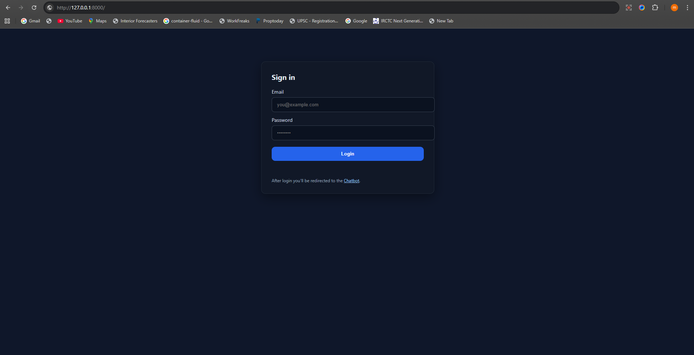

# AI for Organization – One Chat Application

## Functionality
- **One Chat for internal operations**
  The application provides a single chat interface used internally to update day-to-day activities such as timesheets and task details. Employees can ask the chatbot to fill billable and unbillable hours, add daily tasks, and review allocations.
- **Employee performance integration**
  The chat layer can integrate with an employee rating or performance tool to map hours and outcomes to OKRs and performance KPIs.

## Deployment
- **Local development**
  - Start API: `php artisan serve --host=127.0.0.1 --port=8000`
  - Open UI: `http://127.0.0.1:8000/chat.html`
- **Production**
  - Laravel app behind Nginx/Apache with PHP-FPM
  - MySQL for timesheets, tasks, and projects databases
  - Environment secrets via `.env` (never commit)
  - Optional CI/CD via GitHub Actions and zero‑downtime deploy (e.g., Deployer or containerized rollout)

## AI Techniques
- **Rule-based NLU bootstrap**
  - Lightweight pattern extraction for phrases like “4 billable”, “2 unbillable”, and date scopes such as “today” or a specific date.
- **LLM augmentation (optional)**
  - The planner can be extended to call an LLM for richer intent detection, entity extraction (dates, projects), and confirmation prompts.
- **Safety & constraints**
  - Business rules strictly enforced by controllers/services (9-hour billable cap, unbillable capacity cannot be exceeded, closed-day edits blocked).

## Model
- **Pluggable provider**
  - Start with rule-based parsing (no external dependency).
  - Optionally integrate an LLM provider (OpenAI, Azure OpenAI, or a self-hosted model) via a simple interface inside `App\Services\AiPlanner` to enhance understanding and multi-step planning.

## Architecture
```mermaid
flowchart TD
    U[User (Chat UI)] -->|HTTP| API[Laravel API]
    API --> AUTH[Sanctum Auth]
    API --> CHAT[ChatbotController]
    CHAT --> PLAN[AiPlanner Service]
    PLAN --> TS[(daily_timeSheet)]
    PLAN --> TASK[(task_details)]
    API --> PROJ[(projects db)]

    subgraph UI
      CHAT_UI[chat.html]
      LOGIN_UI[login.html]
    end

    U --> CHAT_UI
    CHAT_UI -->|/api/chatbot| CHAT
    LOGIN_UI -->|/api/auth/login| AUTH
```

## Technology Stack
- **Backend**: Laravel 11 (PHP 8.3+)
- **Auth**: Laravel Sanctum (personal access tokens)
- **Databases**: MySQL (separate logical DBs for users, projects, timesheets)
- **Storage & Config**: `.env`-driven, migration-managed schema
- **UI**: Static HTML/JS (`public/login.html`, `public/chat.html`), can be replaced by SPA later

## Innovation Highlights
- **Chat-first internal workflows**
  - Chatbot helps with internal tasks such as applying leave (future extension), filling timesheets, and adding task details quickly.
- **Speed & correctness**
  - Immediate enforcement of timesheet constraints (daily cap, closed day, unbillable capacity), removing back-and-forth and data inconsistencies.
- **Extensible**
  - Pluggable AI model; start simple, scale to enterprise-grade NLU as needed.

## Screenshots
Add screenshots to the paths below to embed them automatically:
- **Login Page**: place file at `docs/screenshots/login.png`
- **Chatbot Page**: place file at `docs/screenshots/chatbot.png`

Once added, they will render here:




## Endpoints Overview
- **Chatbot**: `POST /api/chatbot`
  - Unauthenticated: friendly greeting with `require_login: true`
  - Authenticated: extracts billable/unbillable hours, fills timesheet and tasks.
- **Timesheets**
  - `POST /api/timesheets` – create with `billable_hours` and optional `unbillable_hours`
  - `PATCH /api/timesheets/{id}` – update billable/unbillable, `status`, etc.
- **Tasks**
  - `POST /api/tasks` – create billable or unbillable tasks
  - `PATCH /api/tasks/{id}` – update task fields and hours

## How the Chatbot Decides
1. Parse message for billable/unbillable hours and date (default today).
2. Upsert timesheet for `(date, employee_id)`.
3. Respect rules:
   - Billable daily cap = 9
   - Unbillable tasks cannot exceed `daily_timeSheet.Unbillable_hours`
   - Closed days block billable edits
4. Create tasks and sync totals back to the timesheet.
